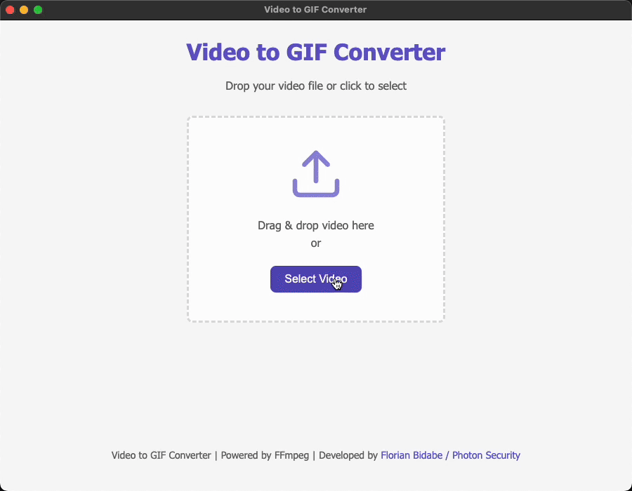

# 🎬 Video to GIF Converter

A desktop application that converts any video file (MP4, MKV, AVI, MOV, WMV, etc.) to multiple optimized GIF versions using FFmpeg. Features both a command-line Ruby script and an Electron-based GUI.

Developed by Florian Bidabe / Photon Security ([www.photonsec.com.au](https://www.photonsec.com.au))

## 📦 Features

- 🧠 Automatically detects supported video files in a folder
- 🎭 Creates three optimized GIF versions for different use cases:
  - **Tiny**: 640px max width, 2 FPS, 128 colors (smallest file size)
  - **Small**: 1280px max width, 2 FPS, 160 colors (balanced)
  - **Medium**: Smart sizing (up to 1980px), 3 FPS, 256 colors (highest quality)
    - Uses 1980px width for videos larger than that
    - Preserves original width for videos between 1280px and 1980px
    - Ensures medium is never smaller than small version
- 📊 Visual comparison of file sizes and quality
- 🧹 Scales videos to appropriate dimensions based on version
- 🎨 Optimizes color palettes for each version
- ✅ Pure Ruby — no external gems required
- 💻 Compatible with macOS, Linux, and Windows


## 📥 Installation

### Option 1: Clone the Repository
```bash
git clone https://github.com/Enelass/video-to-gif.git
cd video-to-gif
npm install
```

### Option 2: Download ZIP
1. Download the ZIP file from [https://github.com/Enelass/video-to-gif/archive/refs/heads/main.zip](https://github.com/Enelass/video-to-gif/archive/refs/heads/main.zip)
2. Extract the ZIP file to a location of your choice
3. Open a terminal and navigate to the extracted directory
4. Run `npm install` to install dependencies

## 🚀 Usage

### Graphical User Interface

The application includes an Electron-based GUI for easier use:

1. Run the application:
```bash
npm start
```



2. For development mode with live reload:
```bash
npm run dev
```

The GUI provides:
- Drag and drop interface for video files
- Real-time conversion progress with console output
- Side-by-side comparison of all GIF versions
- Interactive size comparison chart
- Preview of the original video and all GIF versions
- Detailed metadata display (dimensions, FPS, color depth, etc.)
- Size comparison between original video and all GIF versions
- Tabbed interface to view details of each version


### Command Line Interface

1. Place your video files in the same directory as the script
2. Run the script:

```bash
./video2gif.rb
```

Or:

```bash
ruby video2gif.rb
```

The script will:
1. Scan for video files in the current directory
2. Convert each video to an optimized GIF
3. Save the GIFs in the same directory with the same filename but .gif extension

You can also convert a specific video file by passing it as an argument:

```bash
./video2gif.rb path/to/video.mp4
```

## 🔧 Prerequisites

Make sure your system has:

### ✅ Ruby
Run to verify:
```bash
ruby -v
```

### ✅ FFmpeg
Run to verify:
```bash
ffmpeg -version
```

If FFmpeg is not installed:
- **macOS**: `brew install ffmpeg`
- **Ubuntu/Debian**: `sudo apt install ffmpeg`
- **Windows**: Download from [ffmpeg.org](https://ffmpeg.org/download.html)


## 🛠️ Customization

You can modify the settings in the `config.json` file to adjust the output for each version:

```json
{
  "versions": {
    "tiny": {
      "max_width": 640,
      "fps": 2,
      "color_depth": 128,
      "dither_method": "bayer"
    },
    "small": {
      "max_width": 1280,
      "fps": 2,
      "color_depth": 160,
      "dither_method": "sierra2_4a"
    },
    "medium": {
      "max_width": 1980,
      "fps": 3,
      "color_depth": 256,
      "dither_method": "sierra2_4a"
    }
  },
  "supported_video_extensions": [
    ".mp4", ".mkv", ".avi", ".mov", ".wmv", 
    ".flv", ".webm", ".m4v", ".3gp", ".mpg", ".mpeg"
  ]
}
```

Available dithering methods:
- `bayer`: Ordered dithering using a Bayer matrix
- `heckbert`: Quantizes colors using the Heckbert algorithm
- `floyd_steinberg`: Floyd-Steinberg error diffusion
- `sierra2`: Two-row Sierra error diffusion
- `sierra2_4a`: Modified Sierra-2 error diffusion (default, good balance of quality and speed)

## 📝 Example

```
🎬 video2gif-ruby v1.0.0
Developed by Florian Bidabe / Photon Security (www.photonsec.com.au)
Converting videos to optimized GIFs...
✅ Loaded configuration from config.json
✅ FFmpeg found: /opt/homebrew/bin/ffmpeg
🔍 Found 1 video file(s):
  • input.MP4

🎬 Converting input.MP4 to multiple GIF versions...
  • Original size: 1848x1078

  Creating tiny version:
  • Size: 640x373
  • FPS: 2
  • Color depth: 128 colors
  • Dither method: bayer
  • Generating color palette...
  • Creating optimized GIF...
  ✅ tiny version complete!
    • Size: 0.52 MB (82.49% reduction)
    • Saved to: input-tiny.gif

  Creating small version:
  • Size: 1280x746
  • FPS: 2
  • Color depth: 160 colors
  • Dither method: sierra2_4a
  • Generating color palette...
  • Creating optimized GIF...
  ✅ small version complete!
    • Size: 1.24 MB (58.25% reduction)
    • Saved to: input-small.gif

  Creating medium version:
  • Size: 1200x700
  • FPS: 3
  • Color depth: 256 colors
  • Dither method: sierra2_4a
  • Generating color palette...
  • Creating optimized GIF...
  ✅ medium version complete!
    • Size: 1.63 MB (45.12% reduction)
    • Saved to: input-medium.gif

🎉 Conversion completed!

📊 Size Comparison:
Video 1: input.MP4
  • Original: 2.97 MB (1848x1078)
  • Tiny: 0.52 MB (640x373) - 82.49% reduction
  • Small: 1.24 MB (1280x746) - 58.25% reduction
  • Medium: 1.63 MB (1200x700) - 45.12% reduction
```

## 📄 License

MIT
